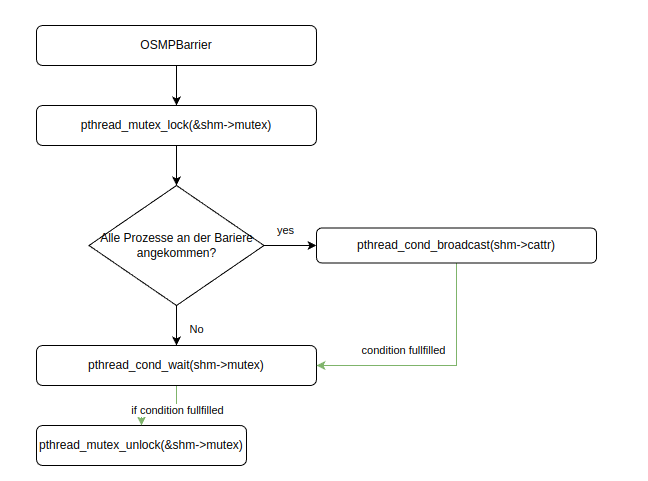
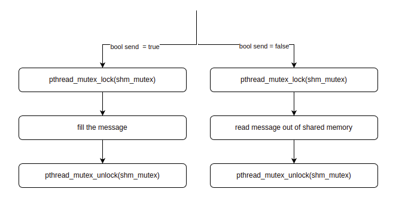
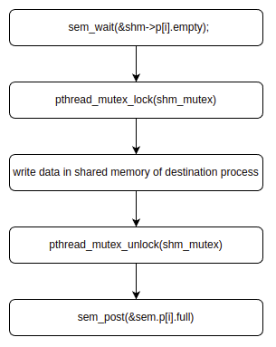
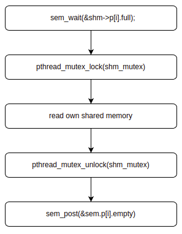
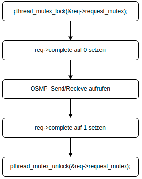
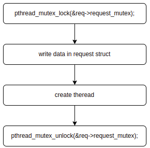
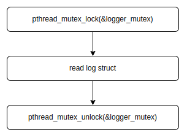
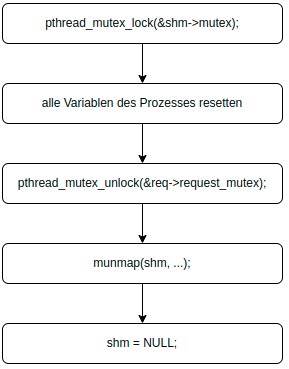

# OSMP - Operating System Message Passing
von [Felix Grüning](https://www.linkedin.com/in/felix-grüning-19443a280/) und [Patrick Zockol](https://www.linkedin.com/in/patrick-zockol-687204253/)

## Ausführung

### Make
1. im Terminal in das Projekt Verzeichnis navigieren
2. `chmod +x ./makeall.sh` 
3. `chmod +x ./testall.sh`
4. `./makeall.sh`

### Syntax
Um das Program zu starten gibt es die folgenden Punkte:
1. Im Terminal ins Projektverzeichnis navigieren
2. `./build/bin/osmp [PROZESSANZAHL] ./build/bin/osmpexecutable {0-9/1337}`

Des weiteren gibt es eine optionale Logger-Syntax:

- `-L {Pfad}` aktiviert den Logger
- `-v {1-3}` (optional) stellt die Stärke des Loggers ein

Die Stärken des Loggers sind wie folgt definiert:

- `1` - Standard Auswahl sollte -v nicht gegeben sein. Beinhaltet Start und Ende von Funktionsaufrufen
- `2` - Beinhaltet alles aus 1, so wie alle ERROR aufrufe, falls welche auftreten
- `3` - Beinhaltet alles aus 1 und 2, inklusive alle `calloc()` und `free()` Aufrufe

Beispielaufrufe:

- `./build/bin/osmp 500 ./build/bin/osmpexecutable 2` Normaler Start des 2. Tests
- `./build/bin/osmp 500 -L ./ ./build/bin/osmpexecutable 2` Start mit Log-Files in ./
- `./build/bin/osmp 500 -L ./ -v 3 ./build/bin/osmpexecutable 2` Start mit Log-Files in ./ mit Stärke 3

Desweiteren gibt es noch eine `testall.sh` im Projektordner, welches mit vorgegebenen Parametern alle Tests aufruft. Es wird im Projektordner der Ordner `./logs/` erstellt, in welchem dann die Logs aller Tests gespeichert werden.

## Struktur des Shared Memory

### Fest definierte Werte

- `MESSAGE_MAX_MESSAGE_PROC = 16`  Maximale Anzahl der Nachichten, die ein Prozess im Postkasten haben darf

- `OSMP_MAX_PALOAD_LENGTH = 1024`  maximale Länge der Nachricht in Bytes

- `OSMP_MAX_SLOTS = 255`  Maximale Anzahl aller Nachrichten, die im System vorhanden sein dürfen

- `SharedMemName = "/shm"`  Name des Shared-Memorys

- `OSMP_ERROR = -1` Vaiable die Zurückgegeben wird, wenn eine Funktion oder Prozess gestoppt wurde und einen Fehler aufweist

- `OSMP_SUCCESS = 0` Vaiable die Zurückgegeben wird, wenn eine Funktion oder Prozess ohne Fehler durchgelaufen ist


### SharedMemory-Struktur

```c
typedef struct {
    int processAmount;
    pthread_mutex_t mutex;
    pthread_cond_t cattr;
    Bcast broadcastMsg;
    int barrier_all;
    int barrier_all2;
    sem_t messages;
    logger log;
    process p[];
} SharedMem;
```

Wir führen hier ein neues Struct Namens "Shared-Memory" ein, und es hat folgende Inhalte:

- *`int processAmmount;`*
Anzahl der Prozesse die bei Programmstart eingegeben wurden
- *`pthread_mutex_t mutex;`*
Der Mutex der für die Blockierung der Prozesse, die auf das Shared Memory gleichzeitig zugreifen wollen, zuständig ist
- *`pthread_cond_t cattr;`*
die Condition, die wartet, wenn die Barrier-Funktion aufgerufen wird
- *`Bcast broadcastMsg;`*
Das Struct Bcast, welches für die Broadcast Message verantwortlich ist
- *`int barrier_all;`*
Die Abbruchbedingung, die die Barrier beendet, falls zu Beginn barrier_all2 == 0 war
- *`int barrier_all2;`*
Die Abbruchbedingung, die die Barrier beendet, falls zu Beginn barrier_all == 0 war
- *`sem_t messages;`*
Die Semaphore, welche Prozesse mit neu einkommenden Nachrichten blockiert sobald die maximale Anzahl an aktiven Nachrichten im System erreicht ist
- *`logger log;`*
Das Struct log, welches den Logger-Path und die Logger-Stärke beinhaltet
- *`process p[];`*
Ein Struct Array, welches alle Prozessdaten wie `pid` und `rank` des jeweiligen prozesses beinhaltet

### Message-Struktur

```c
typedef struct {
    int srcRank;
    char buffer[OSMP_MAX_PAYLOAD_LENGTH];
    size_t msgLen;
} message;
```

- *`int srcRank;`*
Dieser Integer hat den Rank vom sendenden Prozess abgespeichert
- *`char buffer[OSMP_MAX_PAYLOAD_LENGTH];`*
Dieses Array hat als Inhalt die empfangene Nachricht oder '\0', wenn keine Nachricht empfangen wurde
- *`size_t msgLen;`*
Tatsächliche Länge der empfangenen Nachricht in Byte

## Process-Struktur

```c
typedef struct {
    message msg[OSMP_MAX_MESSAGES_PROC];
    pid_t pid;
    int rank;
    int firstEmptySlot;
    int firstmsg;
    sem_t empty;
    sem_t full;
} process;
```

- *`message msg[OSMP_MAX_MESSAGES_PROC];`*
Das Message-Struct welches die Nachrichten des eigenen Prozesses beinhaltet. Es hat ein Auffassungsvermögen von `OSMP_MAX_MESSAGE_PROC`
- *`pid_t pid;`*
Die Prozessnummer des Prozesses
- *`int rank;`*
Der Rang des Prozesses
- *`int firstEmptySlot;`*
Der nächste freie Nachrichtenslot. Er ist gleich `OSMP_MAX_MESSAGE_PROC`, wenn alle Plätze belegt sind
- *`int firstmsg;`*
Der Index des letzten beschrieben Nachrichtenslots
- *`sem_t empty;`*
Die Semaphore, die wartet, wenn der Prozess keine Nachrichten mehr empfangen kann
- *`sem_t full;`*
Die Semaphore, die wartet, wenn der Prozess keine Nachrichten hat

### Broadcast-Struktur

```c
typedef struct {
    char buffer[OSMP_MAX_PAYLOAD_LENGTH];
    size_t msgLen;
    int srcRank;
} Bcast;
```

- *`char buffer[OSMP_MAX_PAYLOAD_LENGTH];`*
Der Buffer für den B-Cast in der Größe von `OSMP_MAX_PAYLOAD_LENGTH`
- *`size_t msgLen;`*
Tatsächliche Länge der empfangenen Nachricht in Byte
- *`int srcRank;`*
Dieser Integer hat den Rank vom sendenden Prozess abgespeichert

### Logger-Struktur

```c
typedef struct {
    int logIntensity;
    char logPath[256];
    pthread_mutex_t mutex;
} logger;
```

- *`int logIntensity;`*
Der Log-Typ, der übergeben wird
- *`char logPath[256];`*
Der Logging-Path, der übergeben wird
- *`pthread_mutex_t mutex;`*
Der Mutex, welcher den Struct Zugriff vor gleichzeitigem Verwenden schützt

## Semaphore- und Mutexnutzung

**NOTE:**
Bei den hier aufgeführten Abläufen handelt es sich um Pseudo-Code. Er dient zur Veranschaulichung und wird nicht korrekt (nach C99-Standard) dargestellt. 

Hier sind die Mutex- und die Semaphorennutzung in unserem OSMP-Projekt erklärt:

Wir verwenden in unserem Programm insgesammt 3 Semaphoren. Ein Semaphore ist für die Messages, und ist dafür zuständig, die Prozesse zu blockieren, wenn mehr als 256 Nachrichten existieren. Die beiden anderen, sind jeweils dafür da, die schreibenden Prozesse warten zu lassen, wenn der Postkasten voll ist und die lesenden Prozesse warten zu lassen, wenn der Postkasten leer ist. 

Es werden ingesamt 3 Mutexe verwendet, welche dazu dienen, vor mehrfachem Zugriff auf das Shared Memory und anderen Structs zu schützen. 

### OSMP_Barrier

Der Aufruf pthread_mutex_lock blockiert den Zugriff auf den Mutex durch andere Prozesse und sperrt den Mutex. Es wird überprüft ob n-1 Prozesse bereits die Barriere erreicht haben Wenn die Bedingung falsch ist, wird der Prozess in eine Warteschleife gebracht, indem pthread_cond_wait aufgerufen wird. Dadurch wird der Thread in einen wartenden Zustand versetzt und der Mutex wird freigegeben, um anderen Prozessen den Zugriff auf den Mutex zu ermöglichen. Wenn die Bedingung wahr ist, werden die folgenden Schritte ausgeführt:

1. pthread_cond_broadcast(&shm->cattr) wird aufgerufen und befreit alle wartenden Prozesse.
2. Prozess n ruft pthread_mutex_unlock auf und ermöglicht einem Prozess aus der Warteschleife zu kommen.

Wenn der Prozess aus der Warteschleife herauskommt (Durch den pthread_cond_broadcast und dem danach folgendem unlock), versucht er erneut, den Mutex zu sperren und die Bedingung zu überprüfen. Wenn die Bedingung wahr ist, wird pthread_mutex_unlock aufgerufen, wenn jedoch die Bedingung weiterhin falsch ist, kehrt der Prozess in die Warteschleife zurück. Dies wird wiederholt, bis alle Prozesse die Barrier verlassen haben.



### OSMP_Bcast

Die OSMP_Bcast schaut als erstes, ob die Funktion vom sendenden oder den empangenden Prozessen aufgerufen wurde. Die Verwendung der Mutexe sind dabei bei den beiden Varianten gleich. Es wird versucht die Mutex zu locken und danach werden die Message beschrieben/gelesen, und der Mutex wieder freigegeben. 



### OSMP_Send

Die OSMP_Send prüft zuerst, ob der Wert der Semaphore `sem_t empty` nicht 0 entspricht. Diese wird beim initialisieren auf `OSMP_MAX_MESSAGES_PROC` gesetzt. Wenn noch keine `OSMP_MAX_MESSAGES_PROC` Nachrichten angekommen sind kann der Prozess weitergehen und zählt die Semaphore um eins nach unten. Danach wird der Mutex des Shared Memory angefordert, und sobald das erfolgreich war, wird der Shared Memory des empfangenden Prozesses beschrieben. Danach wird die Mutex wieder freigegeben, und `sem_post()` aufgerufen, sodass der (wartende) Empfängerprozess seine Nachricht lesen darf. 



### OSMP_Recv

Die OSMP_Recv prüft zuerst, ob `sem_t full` frei ist, diese wird beim initialisieren auf 0 gesetzt. Wenn eine Nachricht angekommen ist, hat der sendende Prozess `sem_post()` mit der Semaphore `sem_t full` aufgerufen und die Semaphore um eins nach oben gezählt. Erst danach darf der empfangende Prozess in die Funktion. Daraufhin wird der Mutex des Shared Memorys angefordert, und sobald der Mutex mit `pthread_mutex_lock()` aufgerufen wurde, die Nachricht im Shared Memory des eigenen Prozesses gelesen. Danach wird der Mutex wieder freigegeben und `sem_post()` aufgerufen, sodass der (wartende) Sende-Prozess seine Nachricht schreiben kann. 



### *isend / *ircv

Die Mutexe dienen hier dazu, die Requests vor gleichzeitigen Zugriffen zu schützen. Zunächst wird der Mutex des Requests gelockt, bevor die Parameter in das IRequest-Struct kopiert werden. Danach wird der Thread erstellt und die Mutex wieder freigegeben. Dadurch wird sichergestellt, dass kein anderer Thread auf den Request zugreift, bevor dieser vollständig initialisiert wurde.



### OSMP_ISend

Um gleichzeitige Zugriffe auf den Request zu vermeiden, wird zunächst der Mutex der Request-Struktur gesperrt. Anschließend werden die Parameter des Requests auf die Funktion übertragen und ein neuer Thread wird erstellt, der die Funktion `*isend() ausführt. Sobald der Thread erstellt wurde, wird der Mutex der Request-Struktur wieder freigegeben, damit andere Prozesse auf den Request zugreifen können.



### OSMP_Irecv

Zunächst wird der Mutex der IRequest-Struktur, auf die der Request zeigt, gesperrt, um gleichzeitige Zugriffe auf den Request zu vermeiden. Danach werden die Parameter des Requests auf die Parameter der Funktion kopiert. Anschließend wird ein neuer Thread erstellt, der mit der Funktion `*ircv()` aufgerufen wird. Sobald der Thread erstellt wurde, wird der Mutex der Request-Struktur wieder freigegeben, damit andere Prozesse auf den Request zugreifen können.


### Debug

In der Funktion wird der Mutex des Loggers verwendet. Der Zugriff auf den Log-Struct ist blockiert, solange der Mutex gesperrt ist. Sobald die Variable ausgelesen wurde, wird der Mutex freigegeben.



### OSMP_Finalize

In der OSMP_Finaize sperrt der Prozess als aller erstes den Mutex des Shared-Memorys. Nachdem der Mutex gelockt wurde, werden alle Variablen des Prozesses, der sie aufgerufen hat resettet, und der Mutex wieder freieggeben.  Danach wird `munmap()` aufgerufen, um den Speicher vom Prozess zu trennen. 




###
###
###
###
###
###
###
###
###
###
###
###


# Danke für's lesen!
###


## Support

Wenn Sie dies hilfreich fanden und das Projekt ihnen gefällt, dann geben Sie uns doch mal einen Kaffe aus:

[](https://www.paypal.com/paypalme/fegrue)

