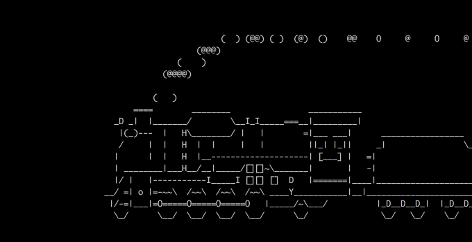

# Struktur des Shared Memory

### SharedMemory-Struktur

```c
typedef struct {
    int processAmount;
    int processesCreated;
    pthread_mutex_t mutex;
    pthread_cond_t cattr;
    Bcast broadcastMsg;
    int barrier_all;
    int barrier_all2;
    sem_t messages;
    pthread_cond_t allCreated;
    logger log;
    process p[];
} SharedMem;
```

Wir führen hier ein neues Struct Namens "Shared-Memory" ein, und es hat folgende Inhalte:

- *`int processAmmount;`*
Anzahl der Prozesse die bei Programmstart eingegeben wurden
- *`int processesCreated;`*
Die anzahl der aktuell erstellten Prozesse
- *`pthread_mutex_t mutex`*
Der Mutex, der den Shared-Memory blockiert
- *`pthread_cond_t cattr;`*
die Condition, die wartet, wenn die Barrier-Funktion aufgerufen wird
- *`int barrierall;`*
Die Abbruchbedingung, die die Barrier beendet
- *`pthread_cond_t allCreated;`*
Die Condition die wartet, wenn noch nicht alle Prozesse gestartet wurden.
- *`logger log`*
Das struct log
- *`process p[]`*
Ein Struct Array, welches alle Prozessdaten wie `pid` und `rank` des jeweiligen prozesses beinhaltet. Dieses Struct entspricht der Größe `sizeof(process * processAmmount)`

### Message-Struktur

```c
typedef struct {
    bool full;
    int srcRank;
    int destRank;
    char buffer[message_max_size];
    OSMP_Datatype datatype;
    int msgLen;
    int nextMsg;
    pthread_cond_t read;
} message;
```

Das struct Message liegt in dem Struct des Shared-Memory. Es hat folgende Inhalte:

- *`bool full;`*
Der Boolean, der agiebt, ob die Message voll ist oder nicht
- *`int srcRank;`*
Dieser Integer hat den Rank vom sendenden Prozess abgespeichert
- *`int destRank;`*
Dieser Integer hat den Rank vom empfangenden Prozess abgespeichert
- *`char buffer[message_max_size];`*
Dieses Array hat als Inhalt die eigendliche Nachticht und wird zu anfang auf die maximal zulässige Anzahl von Zeichen der Nachricht gesetzt
- *`OSMP_Datatype datatype;`*
Der Datentyp der Nachricht
- *`int msgLen;`*
Länge der Nachricht
- *`int nextMsg;`*
Das ist die Slot-ID der nächsten Nachricht.

## Process-Struktur

```c
typedef struct {
    message msg[OSMP_MAX_MESSAGES_PROC];
    pid_t pid;
    int rank;
    int firstEmptySlot;
    int numberOfMessages;
    int firstmsg;
    sem_t empty;
    sem_t full;
} process;
```

- *`message msg[OSMP_MAX_MESSAGE_PROC]`*
Das Message-Struct mit der maximalen Anzahl pro Prozess;
- *`pid_t pid;`*
Die Prozessnummer des Prozesses
- *`int rank;`*
der Rang des Prozesses
- `int firstEmptySlot`
Der Slot des Prozesses, der frei ist. Er ist gleich 16, wenn alle Plätze belegt sind
- *`int numberOfMessages;`*
Die Anzahl der Messages, die der Prozess noch nicht gelesen hat.
- *`int firstmsg`*
    
    Der Index der ersten Nachricht
    
- *`sem_t empty;`*
Die Semaphore, die wartet, wenn der Prozess keine Nachrichten mehr empfangen kann.
- *`sem_t full;`*
Die Semaphore, die wartet, wenn der Prozess keine Nachrichten hat.

### Broadcast-Struktur

```c
typedef struct {
    char buffer[message_max_size];
    int msgLen;
    OSMP_Datatype datatype;
    int srcRank;
} Bcast;
```

- *`char buffer[message_max_size];`*
Der Buffer für den B-Cast in der größe von `max_message_size`
- *`int msgLen;`*
Die Länge des Buffers
- *`OSMP_Datatype datatype;`*
Der Datentyp der Nachricht
- *`int srcRank;`*
Dieser Integer hat den Rank vom Sendenden Prozess abgespeichert

### Logger-Struktur

```c
typedef struct {
    int logIntensity;
    char logPath[256];
} logger;
```

- *`int logIntensity;`*
Der Log-Typ, der übergeben wird
- *`char logPath[256];`*
Der Logging-Path, der übergeben wird

## Semaphoren-Verwaltung

Hier sind die Mutex- und die Semaphorennutzung in unserem OSMP-Projekt erklärt. Wir verwenden in unserem Programm insgesammt 3 Semaphoren,    

### OSMP_Barrier


### OSMP_Size/OSMP_Bcast


### OSMP_Wait/tOSMP_Test


### OSMP_Send/OSMP_Recieve


### OSMP_Isend/OSMP_Irecv


### OSMP_Isend/OSMP_Irecv


Bei der OSMP_Isend und OSMP_Ircv wird der Mutex der Request jedes mal gelockt, sobald der Thread erstellt und übergeben wird. Dadurch kann nämlich vermieden werden, dass Isend gleichzeitig die Threadnummer in den Thread schreibt und die Variablen des Structs an die OSMP_Send weitergibt.

#
#
#
#
#
#
#
#
#
#
#
#
### Danke für's lesen!

